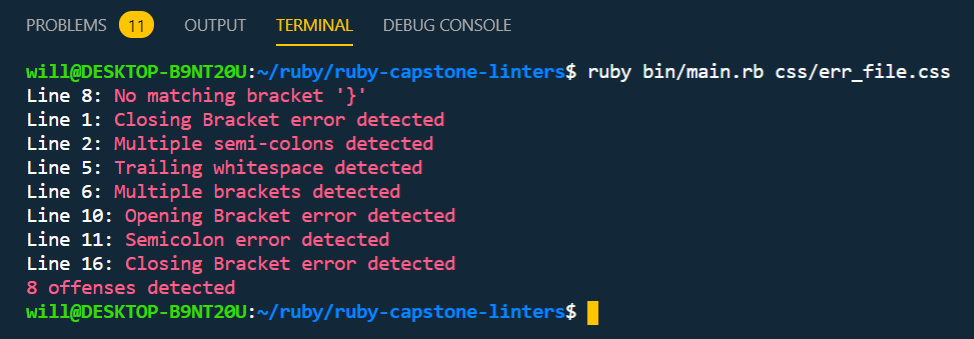

# RUBY CAPSTONE: CSS CUSTOM LINTERS

** This is a CSS linter developed to help debug code and follow best practices **
> A CSS linter project developed in Ruby
> It provides feedback about errors or warning in code

## Built With

- Ruby
- RSpec gem
- Colorize gem
- Object Oriented Programming

## Requirements

-run bundle install

## Instructions

How to run the linters program
   - Open the console
   - Download or `git clone https://github.com/BigWizzo/ruby-capstone-linters.git`
   - `cd ruby-capstone-linters`
   - Run `ruby bin/main.rb path_to_css_file.css
   - Three examples are included inside the css folder for testing the program
     > err_file.css: contains some css errors
     > clean.css: contains clean code
     > err_file.css: empty css file
   - Errors will show on to the console
   
 ## Good vs Bad Code
   ** Good Code **
   
     ```
     .d-flex {
        display: flex;
     }

     .flex-col {
        flex-direction: column;
     }
     ```
   ** Bad Code **
   
     ```
     .d-flex }                * Opening bracket error *
        display: flex;;       * Double semi colons *
     {                        * Closing bracket error *
     }
 
     .flex-col { {            * Multuple brackets error *
        flex-direction: column;
     } |                      * Trailing white space *

.    a-flex { gst             * Content after opening bracket *
       display: flex; dhs     * Content after semicolon *
     }                        * Content before closing bracket *
     ```
    
 ## Running Tests
   
   - Open the console
   - Navigate to the css working folder
   - Run gem install rspec
   - Run rspec
   - The spec file is in the spec folder

## Authors

👤 **Will Nyamunokora**

- Github: [@bigwizzo](https://github.com/bigwizzo)
- Twitter: [@willnyamunokora](https://twitter.com/willnyamunokora)
- Linkedin: [linkedin Profile](https://www.linkedin.com/in/willnyamunokora/)

## Show your support

Give a ⭐️ if you like this project!
